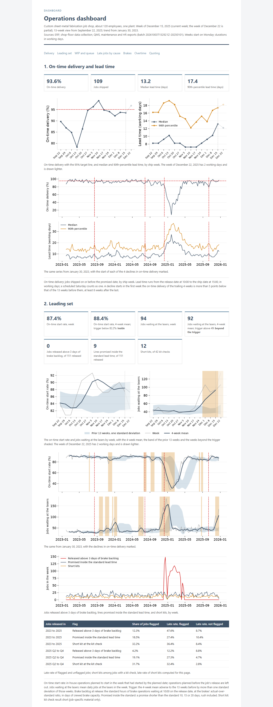

# mfg-operations-analytics

Delivery, flow, capacity and quoting analytics on a custom sheet-metal fabrication job shop, January 2023 to December 2025, computed on the shop's complete ERP and MES record.



## What is included

- Eight connected studies, each delivered as a client report, with an A3 for each improvement project: lead-time decomposition, late-job attribution, the constraint and variability, setups against standards, release control on a discrete-event model of the floor, leading indicators, lead-time quoting and quote analytics, technology ROI.
- One operations dashboard: on-time delivery, lead time, WIP, utilization and queue by work center, setup against standard, overtime, the leading indicators; weekly grain, 13-week view, three-year trend.
- A data pipeline from raw system exports to analysis-ready marts: DuckDB, dbt with schema tests, one build command that regenerates every table, figure and page byte-identically.

## Business context

The shop is a custom sheet-metal fabricator: about 120 employees, ISO 9001, one plant, about 2,000 active part numbers, 450 customers, 4,800 jobs a year in lots from 1 to 500 pieces. Laser cutting, CNC punching, press brake forming, hardware insertion, welding, powder coating and light assembly in house; plating, anodizing and heat treat at outside vendors. Two shifts on the lasers and brakes, one elsewhere, Saturdays when behind.

The shop quotes a fixed lead time by routing class, measures on-time delivery weekly, and records a late reason on each late job. In 2025 it delivered 82% on time. The late-reason codes did not explain the misses: a large share were blank, and the coded ones pointed at the operation where the job was found late rather than where it lost the time. A first-quarter decline that year was felt on the floor as a brake-capacity problem, and the shop was weighing a second press brake with automatic tooling against a laser tower and a bending cell.

The engagement put the ERP order and quote records beside the MES operation timestamps for three years, every job and every operation, to answer what the reports could not: where lead time goes, which stage each late job lost its days at, which work center sets the lead time and what variability at it costs, which indicators move before delivery slips, what lead time the shop should quote at its current load, and which of the capital options pays back on measured hours. The studies below are the result, in the order they were built.

## Studies

| Project | Question | Finding | Deliverable |
|---|---|---|---|
| P1. Lead time decomposition | Where does the lead time go, and does the floor's WIP match the quoted lead times? | Queue at the brakes is 28% of lead time and the stage that separates late jobs from on-time jobs (6.98 days against 2.71); the median job ships in 11.2 working days against an average quoted lead time of 12.4, 9.2 in Q2 to Q4. | [report](docs/reports/p1_lead_time.html), [A3](docs/a3/p1_lead_time.html) |
| P2. Why jobs are late | What makes jobs late, and do the shop's late-reason codes say so? | For the year, constraint queue is 36% of the 4,647 lost days, unexplained 33%, released late 17%, material 6.5% and outside processing 3%; the year is the 2024 year-end build shipping in the first quarter. | [report](docs/reports/p2_late_jobs.html), [A3](docs/a3/p2_late_jobs.html) |
| P3. The constraint, utilization and variability | Which work center is the constraint, and how does its queue respond to load? | The brakes run at 0.91 of scheduled hours net of downtime, the robotic weld cell at 0.83, the lasers at 0.74, assembly through hardware at 0.66 to 0.69 and the powder line at 0.56. | [report](docs/reports/p3_constraint.html), [A3](docs/a3/p3_constraint.html) |
| P4. Setups and standards | What do setups cost at the brakes, and where is the overrun? | Brake setups ran 6,077 hours against 4,235 standard in 2025: 1,842 hours over, 35 a week, 11% of brake machine time. | [report](docs/reports/p4_setups.html), [A3](docs/a3/p4_setups.html) |
| P5. Release control and the shop model | Do release control and dispatch rules help, and what does? | A WIP cap and dispatch rules do not help; the setup program, a second shift on the robotic weld cell and planned Saturdays from November through February take the year to 88.0% on time, up 6.0 points (5.0 to 6.9), and Q2 to Q4 to 91.8%. | [report](docs/reports/p5_release_control.html), [A3](docs/a3/p5_release_control.html) |
| P6. Leading indicators | Which weekly measures move before on-time delivery does? | The on-time start rate correlates +0.62 with on-time delivery 1 week later, against a 95th percentile of +0.24 on shuffled series and +0.21 on shifted series. It moved before all four declines in on-time delivery; no other weekly measure leads in ordinary weeks. | [report](docs/reports/p6_leading_indicators.html), [A3](docs/a3/p6_leading_indicators.html) |
| P7. Lead-time quoting and quote analytics | What lead time should be quoted, and what wins quotes? | The fixed quote is met on 53.0% of non-rush jobs for the year and 70.5% in Q2 to Q4; a quote by routing class and brake backlog at release, never below the fixed quote, is met on 67.0% and 82.1% out of sample and lengthens 43.6% and 33.9% of promises. | [report](docs/reports/p7_quoting.html), [A3](docs/a3/p7_quoting.html) |
| P8. Technology ROI | Do the capital options pay back? | On overtime and labor alone no option pays back within the 7-year horizon, and the no-capital package is net negative ($70,000 a year, the weld cell's second shift). With half the released brake hours sold, the robotic cell pays back in 1.6 years, the tool changer on B3 in 3.9, the laser tower not at all. | [report](docs/reports/p8_technology_roi.html), [A3](docs/a3/p8_technology_roi.html) |

**Dashboard.** [docs/dashboard/index.html](docs/dashboard/index.html). Index of deliverables: [docs/index.html](docs/index.html). The week of 15 December 2025 is the current week; every panel carries a one-line definition in the reports' wording.

## Methods

Operations analysis: lead-time decomposition and Little's Law; utilization and queue-time curves on the shop's own data; late-job attribution by stage against the stage's own normal; setup and standard variance by lot size and work center; a reproducible discrete-event model of the floor with 19 scenarios, replications and intervals; lead-time quoting from the actual distribution by routing class and load, evaluated out of sample; leading-indicator tests against shuffled and shifted chance series; ROI with payback and break-even analysis on stated assumptions.

Data engineering: raw system exports loaded to DuckDB; a dbt project with schema tests on every mart; one build command that regenerates every table, figure and page byte-identically from the committed inputs; fixed input ordering and per-scenario seeding so that the floor model reproduces to the digit.

Framing: the improvement projects are written as DMAIC projects with an A3 each. Every report describes the findings and what to do, in the form a client receives at the end of an engagement.

## Data

The record carries what these systems carry in practice: blank and miscoded late reasons, operations closed in batches at the end of a shift, standards not updated after routing changes, and a 2024 year-end build that shows in every queue. The analyses work with the record as it stands and say so where it limits a finding.

| System | Export | Tables | Grain | Batch |
|---|---|---|---|---|
| ERP | data/raw/erp/ (16 CSV files) | customers, export_batch, inventory_items, inventory_transactions, job_operations, jobs, order_lines, parts, po_lines, purchase_orders, quote_lines, quotes, routings, sales_orders, shipments, work_center_calendar | customer, part, routing operation, quote, quote line, sales order, order line, job, job operation, inventory item, inventory transaction, purchase order, PO line, shipment, work center and day, export batch | 20261003T152921Z-20250101 |
| Shop-floor data collection | data/raw/mes/ (6 CSV files) | holds, job_status_events, kit_checks, labor_transactions, laser_nests, powder_color_schedule | labor transaction, job status event, hold, kit check, laser nest, powder color and day | 20261003T152921Z-20250101 |
| QMS | data/raw/qms/ (2 CSV files) | ncrs, rework_ops | nonconformance, rework operation | 20261003T152921Z-20250101 |
| Maintenance | data/raw/maintenance/ (1 CSV file) | downtime_events | downtime event | 20261003T152921Z-20250101 |
| HR | data/raw/hr/ (2 CSV files) | attendance, employees | employee, employee and day | 20261003T152921Z-20250101 |

`pipeline/load` loads the CSV exports under `data/raw` into DuckDB with dlt, one text table per file. The dbt project under `pipeline/dbt` builds the staging models (one per export, typed), the intermediate models (working-day clock, machine time, queue, lead time by stage, WIP, utilization, setups, late-job attribution) and the marts, with tests on keys. The scripts under `analytics/` read the marts and write each project's report, A3 and figures under `docs/`, the dashboard and this file. The shop model under `analytics/p5_release_control/` replays the released jobs for the scenarios of P5 and P8; its runs are saved under `results/` and each run repeats exactly from its scenario and replication number.

## How to run

Python 3.12 or later, from a clean clone:

```
python -m venv .venv
.venv\Scripts\activate            # Windows; on Linux or macOS: source .venv/bin/activate
pip install -e .
python -m pipeline.load.load_exports
cd pipeline/dbt
dbt build --profiles-dir .
cd ../..
python -m analytics.build_all
```

`analytics.build_all` uses the saved model runs. To repeat the runs (several hours on six processes):

```
python -m analytics.p5_release_control.scenarios 30 6
python -m analytics.p8_technology_roi.scenarios 30 6
python -m analytics.p8_technology_roi.scenarios 30 6 laser_queue
```

## Author

Brian Davis. Data engineering and applied analytics/ML for manufacturers. Other work: [github.com/brimsystems](https://github.com/brimsystems?tab=repositories).
